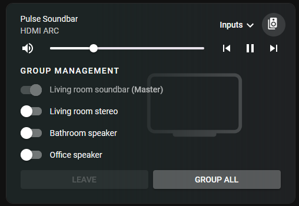

# Alternative Bluesound Integration for Home Assistant
This project is an alternative integration for Bluesound speakers.

[](https://my.home-assistant.io/redirect/hacs_repository/?owner=aunefyren&repository=bluesound_alt)  

<br>
<br>

> [!IMPORTANT]  
> This integration is built on top of the official one. I did not create all the original source code, but I am developing it further. Everything might not be perfect yet as I am learning and fixing the code. Feel free to open an issue to contribute.

## Main features
* Group variable refreshes properly in Home Assistant
* Group variable works with groups bigger than two
* Works with [Mini Media Player](https://github.com/kalkih/mini-media-player) grouping 
* Further updates if improvements can be made

<br>
<br>

## Installation instructions
The installation within Home Assistant is identical to the official Bluesound integration, but you have to select the platform `bluesound_alt` for your media players.

1. Install `bluesound_alt` in HACS (might have to be added as a custom repository)
2. Open the Home Assistant `configuration.yaml` and add the Bluesound media speakers using the `bluesound_alt` platform

`configuration.yaml` example:
```
media_player:
  - platform: bluesound_alt
    hosts:
      - host: 192.168.10.73
        name: C700 Amplifier
      - host: 192.168.10.46
        name: Pulse Soundbar
      - host: 192.168.10.77
        name: Pulse Flex Bathroom
      - host: 192.168.10.93
        name: Pulse Flex Office
```

<br>
<br>

### Example: Mini Media Player YAML
I fixed the original integration for Bluesound mostly because I wanted to do proper speaker grouping. This is something I wanted to achieve through the Mini Media Player card. Below is an example of how you can use the `bluesound_alt` speaker devices through Mini Media Player:

```
type: vertical-stack
cards:
  - type: custom:mini-media-player
    entity: media_player.pulse_soundbar_2
    artwork: material
    group: false
    hide:
      power: true
      icon: true
      source: false
    speaker_group:
      platform: bluesound
      show_group_count: true
      entities:
        - entity_id: media_player.pulse_soundbar_2
          name: Living room soundbar
        - entity_id: media_player.c700_amplifier_2
          name: Living room stereo
        - entity_id: media_player.pulse_flex_bathroom
          name: Bathroom speaker
        - entity_id: media_player.pulse_flex_office_2
          name: Office speaker

```

Note that the platform here says `bluesound`. This is because Mini Media Player sort of has Bluesound support, but it doesn't work properly because the official integration is old. By selecting `bluesound` in the card configuration we are using their Bluesound settings with our Bluesound Alt devices.

Result: 



<br>
<br>

## Ideas for further development
Would love to hear how many Bluesound users there are who also use Home Assistant. Hoping to hear some suggestions on what people are missing and what could be improved.
* Optimize code for faster/more efficient speaker communication?
* Add speakers through the UI?