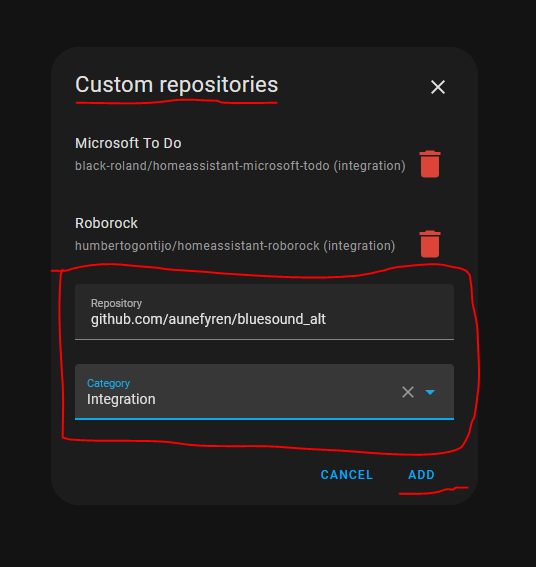
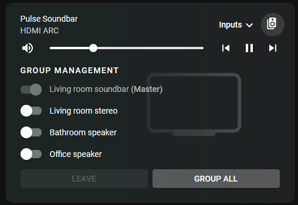

# Alternative Bluesound Integration for Home Assistant


> [!NOTE]
> Parts of this integration were co-written with Claude (Anthropic AI). The code has been reviewed and tested against real Bluesound hardware.

This project is an alternative integration for Bluesound/BluOS speakers, rewritten from scratch using modern Home Assistant patterns.

<br>
<br>

[](https://my.home-assistant.io/redirect/hacs_repository/?owner=aunefyren&repository=bluesound_alt)  
Must be added as a custom repository.

<br>
<br>

> [!IMPORTANT]
> This is a full rewrite, not a fork of the official Bluesound integration. It uses the modern HA integration architecture: UI-based setup (config flow), a coordinator per device, and native HA grouping. If you were using the previous version of this integration, you will need to re-add your devices through the UI.

<br>
<br>

## Main features
* UI-based setup, no `configuration.yaml` editing required
* Correct group join/unjoin with immediate state updates
* Per-speaker volume control within groups (individual volume, not just group volume)
* Group state works with groups of any size
* Source/input selection (physical inputs and streaming services)
* Works with [Mini Media Player](https://github.com/kalkih/mini-media-player) grouping
* Long-poll based updates, reacts to changes instantly rather than polling on a fixed interval

<br>
<br>

## Installation instructions

1. Add this repo to HACS as a custom repository



<br>

2. Install `Bluesound Alt` in HACS
3. Restart Home Assistant
4. Go to **Settings → Integrations → Add Integration** and search for `Bluesound Alt`
5. Enter the IP address and port (default: 11000) for each speaker, repeat for every device

<br>
<br>

### Example: Mini Media Player YAML

This integration works with [Mini Media Player](https://github.com/kalkih/mini-media-player) for speaker grouping. Use `platform: media_player` in the `speaker_group` config, this is the correct setting for the modern HA grouping API this integration uses.

```yaml
type: custom:mini-media-player
entity: media_player.c700_amplifier
artwork: material
hide:
  power: true
  icon: true
  source: false
speaker_group:
  platform: media_player
  supports_master: true
  show_group_count: true
  entities:
    - entity_id: media_player.c700_amplifier
      name: Living room stereo
    - entity_id: media_player.pulse_soundbar
      name: Living room soundbar
    - entity_id: media_player.pulse_flex_bathroom
      name: Bathroom speaker
    - entity_id: media_player.pulse_flex_office
      name: Office speaker
```

> [!NOTE]
> Previous versions of this integration used `platform: bluesound` in MMP. This no longer works correctly. Change it to `platform: media_player` with `supports_master: true`.

<br>

Result:



<br>
<br>

## Ideas for further development

* Repeat mode control
* Media browsing (browse and play from streaming services)
* Preset support
* Alarm/sleep timer support
